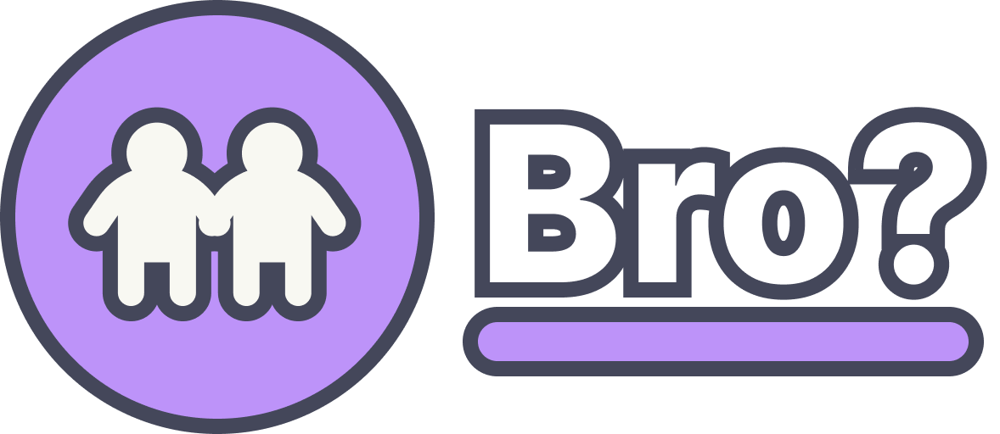

[![Contributors][contributors-shield]][contributors-url]
[![Forks][forks-shield]][forks-url]
[![Stargazers][stars-shield]][stars-url]
[![Issues][issues-shield]][issues-url]
[![MIT License][license-shield]][license-url]


<!-- PROJECT LOGO -->
<br />
<div align="center">
  <a href="https://github.com/BroResearch/Bro">
    
  </a>

  <h3 align="center">Bro?</h3>

  <p align="center">
    Ktor social network to share your posts!
    <br />
    <br />
    <a href="https://broo.social">View Demo</a>
  </p>
</div>


<!-- TABLE OF CONTENTS -->
<details>
  <summary>Table of Contents</summary>
  <ol>
    <li>
      <a href="#about-the-project">About The Project</a>
      <ul>
        <li><a href="#built-with">Built With</a></li>
      </ul>
    </li>
    <li>
      <a href="#getting-started">Getting Started</a>
      <ul>
        <li><a href="#prerequisites">Prerequisites</a></li>
        <li><a href="#usage">Usage</a></li>
      </ul>
    </li>
    <li><a href="#roadmap">Roadmap</a></li>
    <li><a href="#license">License</a></li>
  </ol>
</details>


<!-- ABOUT THE PROJECT -->
## About The Project

[![Bro? Screen Shot][bro?-screenshot]](#)

There are many great README templates available on GitHub; however, I didn't find one that really suited my needs so I created this enhanced one. I want to create a README template so amazing that it'll be the last one you ever need -- I think this is it.

Here's why:
* Your time should be focused on creating something amazing. A project that solves a problem and helps others
* You shouldn't be doing the same tasks over and over like creating a README from scratch
* You should implement DRY principles to the rest of your life :smile:

Of course, no one template will serve all projects since your needs may be different. So I'll be adding more in the near future. You may also suggest changes by forking this repo and creating a pull request or opening an issue. Thanks to all the people have contributed to expanding this template!

Use the `BLANK_README.md` to get started.


### Built With

These are the main frameworks/libraries used to build this project.

* [![Kotlin][Kotlin]][Kotlin-url]
* [![TailwindCSS][TailwindCSS]][TailwindCSS-url]
* [![JavaScript][JavaScript]][JavaScript-url]
* [![Gradle][Gradle]][Gradle-url]


<!-- GETTING STARTED -->
## Getting Started

To get a local copy up and running follow these simple example steps.

### Prerequisites

You need java dependencies to run the gradle commands.
* java
  ```sh
  java -version
  ```

### Usage

_Below is an example of how you can build bro._

1. Clone the repo
   ```sh
   git clone https://github.com/BroResearch/Bro.git
   ```
2. cd into it
   ```sh
   cd Bro
   ```
3. Execute this command to run
   ```sh
   ./gradlew run
   ```
Then, the program responds at http://0.0.0.0:8080 and https://0.0.0.0:8443


<!-- ROADMAP -->
## Roadmap

- [x] Add mobile support
- [x] Add Api documentation
- [x] Add error viewer
- [ ] Add Edit user component
- [ ] Fix bugs in the user interface
    - [ ] Fix post displayer
    - [ ] Fix error displayer

See the [open issues](https://github.com/BroResearch/Bro/issues) for a full list of proposed features (and known issues).


<!-- LICENSE -->
## License

Distributed under the MIT License. See `LICENSE` for more information.


<!-- MARKDOWN LINKS & IMAGES -->
<!-- https://www.markdownguide.org/basic-syntax/#reference-style-links -->
[contributors-shield]: https://img.shields.io/github/contributors/BroResearch/Bro.svg?style=for-the-badge
[contributors-url]: https://github.com/BroResearch/Bro/graphs/contributors
[forks-shield]: https://img.shields.io/github/forks/BroResearch/Bro.svg?style=for-the-badge
[forks-url]: https://github.com/BroResearch/Bro/network/members
[stars-shield]: https://img.shields.io/github/stars/BroResearch/Bro.svg?style=for-the-badge
[stars-url]: https://github.com/BroResearch/Bro/stargazers
[issues-shield]: https://img.shields.io/github/issues/BroResearch/Bro.svg?style=for-the-badge
[issues-url]: https://github.com/BroResearch/Bro/issues
[license-shield]: https://img.shields.io/github/license/BroResearch/Bro.svg?style=for-the-badge
[license-url]: https://github.com/BroResearch/Bro/blob/main/LICENSE
[bro?-screenshot]: uploads/screenshot.png
[Kotlin]: https://img.shields.io/badge/kotlin-%237F52FF.svg?style=for-the-badge&logo=kotlin&logoColor=white
[Kotlin-url]: https://kotlinlang.org/
[TailwindCSS]: https://img.shields.io/badge/tailwindcss-%2338B2AC.svg?style=for-the-badge&logo=tailwind-css&logoColor=white
[TailwindCSS-url]: https://tailwindcss.com/
[JavaScript]: https://img.shields.io/badge/javascript-%23323330.svg?style=for-the-badge&logo=javascript&logoColor=%23F7DF1E
[JavaScript-url]: https://www.ecma-international.org/publications-and-standards/standards/ecma-262/
[Gradle]: https://img.shields.io/badge/Gradle-02303A.svg?style=for-the-badge&logo=Gradle&logoColor=white
[Gradle-url]: https://gradle.org/
